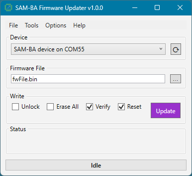
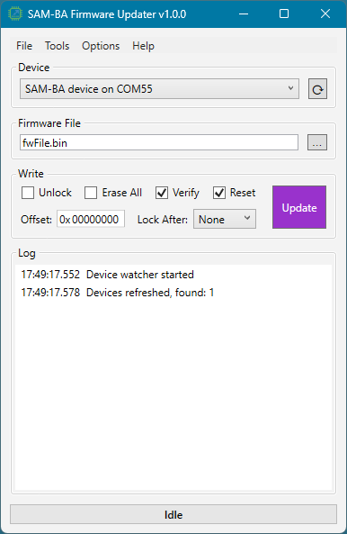

# SAM-BA Firmware Updater

A portable Windows desktop application for Atmel/Microchip SAM-BA operations — firmware update,
flash erase, chip identification, and device discovery over USB CDC.

Serves as both a demo for the `Anp.Atmel.SamBa` library and a functional portable
firmware updater.

## Features

- **Firmware update** — erase / write / verify a raw binary image, optional reset after
- **Erase** — full chip erase (Arduino `X#` chip-erase when advertised, controller erase otherwise)
- **Reset** — per-family RSTC/AIRCR device reset
- **Chip Info** — show the identified chip's flash geometry and monitor version
- **Supported chips** — list every chip type the tool can flash (Help → Show Supported Chips),
  grouped by family; no device required
- **About** — Help → About shows the app version and the `Atmel.SamBa` library version
- **Device discovery** — enumerates SAM-BA USB CDC ports (VID `0x03EB`, PID `0x6124`), custom VID/PID ports, or all  COM ports;
  event-driven hot-plug watcher
- **Offset** (advanced mode) — page-aligned write offset into flash (hex, default 0), e.g.
  `2000` to preserve a SAMD21 bootloader; persisted
- **Lock After Write** (advanced mode) — None (default) / Written / All: which flash lock
  regions to lock after the update; Written covers only the regions the image occupies, not
  the whole flash; persisted
- **Boot to Flash** (Options, on by default) — set the boot source to flash after the update;
  persisted
- **Set Security** (Options, off by default) — permanently set the security bit after the
  update (confirmed before use); not persisted, so each session must opt in again

## Requirements

- Windows, .NET Framework 4.8 (the discovery/watcher surface of the library is Windows-only).
Single-file executable: dependencies are embedded (Costura), output `SamBaUpdater.exe`.
- A SAM device in SAM-BA / bootloader mode enumerating as a USB CDC serial port

## Getting started

1. Connect the board in SAM-BA mode (erase + reset, or double-tap reset on Arduino boards)
2. Select the device from the dropdown (auto-selected when only one is present)
3. Pick a raw binary firmware file (`.bin`)
4. Click **Update**

## Notes and limitations

- Raw binary files only — convert `.hex`/`.elf` before flashing.
- **Unlock** clears all flash lock regions on the connected device (Tools → Unlock). This is
  distinct from the security bit, which SAM-BA cannot clear — that requires the hardware ERASE pin.
- **Unlock** (Write group checkbox, off by default) unlocks any locked flash regions automatically
  before each erase/write, so programming a locked part doesn't fail with a lock error. Distinct
  from the one-shot **Tools → Unlock**; setting is persisted.
- **Safe Mode** loads the flash latch one word at a time instead of one batched transfer
  per page — slower, but robust with bootloaders that drop data mid-stream. Off by default.
- **Chip Identification** (Options) picks which probe decides between the legacy AT91SAM7/9
  CHIPID register and the Cortex-M CPUID register on connect. **Auto** (default) reads the ARM
  reset vector and is right almost every time; **Force ChipID**/**Force CpuID** skip that read
  and go straight to the named probe — only use one on a part whose core generation you already
  know, since forcing the wrong one hangs the SAM-BA monitor. Setting is persisted.
- **Flash Geometry Precedence** (Options) picks which account wins if the connected part's own
  reported flash geometry disagrees with its device-table row. **Table** (default) trusts the
  datasheet-sourced row, since the device's own reading is never verified against real silicon;
  **Device** trusts the part's own reading instead — only use it when the table row itself is known
  to be wrong for the connected part and no corrected release of this app is available yet. Either
  way the disagreement is logged. Setting is persisted.
- **Device Filter** chooses which USB serial devices are listed. Default is **Atmel SAM-BA
  (03EB:6124)**; **Any device** clears the VID/PID filter and lists every serial port — needed
  to reach Arduino / custom SAM boards that enumerate under their own VID/PID; **Custom VID/PID**
  filters by a VID/PID you enter in hex (leave either field blank to match any). In the Any/Custom
  modes the list may include non-SAM-BA ports; device identity is confirmed on connect. The
  selection and custom VID/PID are persisted.
- On SAM3/SAM4/SAM9XE/SAMx7x, verification reads run word-by-word (slower): the ROM's block
  read answers with zeros for flash on those parts.
