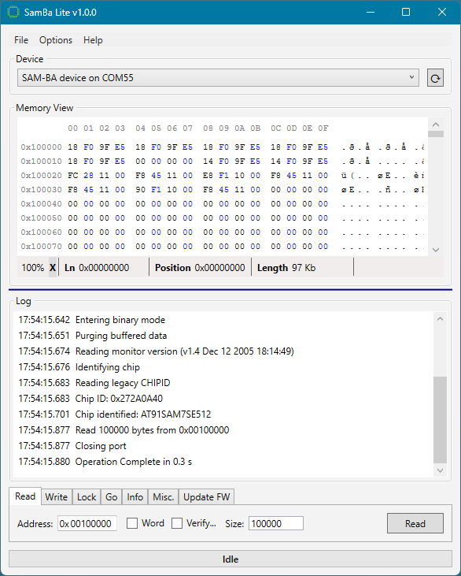

# SamBa Lite (WPF)

A portable Windows desktop tool for poking at Atmel/Microchip SAM devices over the SAM-BA USB CDC monitor.
Tab-per-operation workflow (Read / Write / Lock / Go / Info / Misc. / Update FW),
built on the Anp.Atmel.SamBa library, with the 
[WPFHexaEditor](https://www.nuget.org/packages/WPFHexaEditor) control as the memory view.

Compared to the sibling `SamBaUpdater` app (which is a focused firmware updater), SamBa Lite is
the engineer's Swiss-army knife: raw memory reads into a hex view, word and file writes at
arbitrary addresses, lock/security/boot-bit control, jump-and-execute, and a full-featured
firmware Updater.

## Layout

- **Device** — the discovery-driven device selector: devices appear and disappear with USB
  plug/unplug (watcher), or on demand via the refresh button. Every operation opens the port,
  runs, and closes the port again, so the device stays available to other tools between
  operations.
- **Operation tabs**:
  - **Read** — read any address range into the memory view. The address context menu offers
    the identified chip's flash base. On SAM3/SAM4/SAM9XE/SAMx7x reads run word-by-word
    (slower): the ROM's block read answers with zeros for flash, including its boot alias
    at address 0. Verify compares read memory against a file.
  - **Write** — *Write Word* writes one 32-bit value as a single bus word access (the right
    form for RAM and peripheral registers); *Write File* writes a binary at an address through
    the library's routed write (flash ranges are page-programmed with read-modify-write of
    partial pages).
  - **Lock** — lock/unlock all flash lock regions or a listed subset (`0-3, 8` — the same
    range syntax the Display button logs, so its output pastes straight back in; an empty
    list means all regions), and display which regions are locked.
  - **Go** — jump to an address and execute, no confirmation prompt and no alignment check
    (Thumb-mode targets are odd addresses, so alignment can't be enforced).
  - **Info** — read-only diagnostics: Device Properties, Chip Info, and a Device Status log
    (boot source, security bit, locked regions, unique id).
  - **Misc.** — Reset, boot-source selection (flash/ROM), Set Security (confirmed),
    and Erase All Flash.
  - **Update FW** — firmware update with Offset / Unlock Before Write / Erase All / Verify /
    Lock scope / Security / Boot to Flash / Reset After Load options. Offset (hex, default 0)
    writes the image partway into flash instead of at its base. Lock is a dropdown (None /
    Written / All): Written covers only the regions the image occupies, not the whole flash —
    use the Lock tab for that. Offset and Lock persist across restarts (defaults 0 and None);
    Security deliberately resets to off on every start.
- **Memory View** — read-only hex viewer (WPFHexaEditor). The offset column shows real device
  addresses; bytes per line (4/8/16) is in Options; `File ▸ Save View as Binary/Text` exports
  the current contents (text export optionally prefixes each line with its address, and a
  `.csv` extension switches to comma separation).
- **Log** — timestamped operation log with per-page progress detail; select + copy, `Del` to
  clear, `File ▸ Save Log`.
- **Help ▸ Show Supported Chips** — lists every chip type the tool can flash, grouped by family.
- **Help ▸ About** — shows the app version and the `Atmel.SamBa` library version.

## Options

- **Enable Watcher** — event-driven plug/unplug detection.
- **Enable Safe Mode** — word-at-a-time flash latch loading (and, on parts read word-by-word,
  one read reply awaited per word); slower but robust with bootloaders that drop data
  mid-stream.
- **Device Filter** — Atmel SAM-BA (03EB:6124, default), custom VID/PID, or any serial port
  (for Arduino / custom-VID boards; chip identity is verified on connect).
- **Chip Identification** — Auto (default), Force ChipID, or Force CpuID: which probe decides
  between the legacy AT91SAM7/9 CHIPID register and the Cortex-M CPUID register on connect.
  Auto reads the ARM reset vector and is right almost every time; force one only on a part
  whose core generation you already know, since forcing the wrong one hangs the SAM-BA monitor.
- **Flash Geometry Precedence** — Table (default) or Device: which account wins if the connected
  part's own reported flash geometry disagrees with its device-table row. Table trusts the
  datasheet-sourced row, since the device's own reading is never verified against real silicon;
  choose Device only when the table row itself is known to be wrong for the connected part and no
  corrected release of this app is available yet. Either way the disagreement is logged.

Settings persist per user (`File ▸ Open Settings Location`), including the selected tab and
the last addresses — matching the old tool's habit of remembering where you were working.

## Requirements

Windows, .NET Framework 4.8 (the discovery/watcher surface of the library is Windows-only).
Single-file executable: dependencies are embedded (Costura), output `SamBaLite.exe`.
